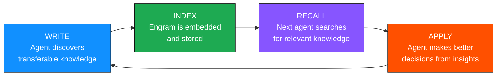

# pi-agent-engrams

Agent knowledge-sharing system for [pi](https://github.com/badlogic/pi). When an agent discovers something transferable during a task — a debugging technique, an API quirk, an architectural pattern — it writes a structured **engram** document. Later, any agent can semantically search the engram store to recall relevant knowledge before starting work.

The key constraint: engrams must be **transferable across projects**. Project-specific facts (file paths, schemas, config values) pollute search results and erode trust. The system steers agents toward patterns, principles, and non-obvious insights that help any agent on any codebase.

## Table of Contents

- [Install](#install)
- [Setup](#setup)
- [How it works](#how-it-works)
- [Tools](#tools)
- [Commands](#commands)
- [Configuration reference](#configuration-reference)
- [Performance](#performance)
- [License](#license)

## Install

```bash
pi install git:github.com/samfoy/pi-agent-engrams
```

Or try without installing:

```bash
pi -e git:github.com/samfoy/pi-agent-engrams
```

## Setup

Run the interactive setup command inside pi:

```
/engrams-setup
```

This walks you through:
1. **Engram directory** — Where engram markdown files are stored (default: `~/.pi/agent/engrams/docs`)
2. **Embedding provider** — OpenAI, AWS Bedrock, or local Ollama
3. **Embedding model** (default: `Qwen3-Embedding-0.6B-4bit-DWQ`)
4. **Embedding dimensions** (default: `512`)

Config is saved to `~/.pi/agent-engrams.json`. Run `/reload` to activate.

After setup, run `/engrams-seed` to bootstrap the store with meta-engrams that teach agents how to use the system effectively.

### Config file

You can also edit the config file directly:

```json
{
  "dir": "~/.pi/agent/engrams/docs",
  "dimensions": 512,
  "provider": {
    "type": "openai",
    "model": "Qwen3-Embedding-0.6B-4bit-DWQ"
  }
}
```

The API key for OpenAI can be set in the config file (`"apiKey": "sk-..."`) or via the `OPENAI_API_KEY` environment variable. The default **`model`** targets local OpenAI-compatible servers (e.g. omlx with `Qwen3-Embedding-0.6B-4bit-DWQ`). For **OpenAI's hosted API**, set `"model": "text-embedding-3-small"` (or another OpenAI embedding model) and ensure **`dimensions`** matches that model.

### Understanding `dimensions`

The `dimensions` field specifies the number of values in each embedding vector. Different embedding models produce different sized vectors:

| Model | Dimensions |
|-------|------------|
| `nomic-embed-text` | 768 |
| `Qwen3-Embedding-0.6B-4bit-DWQ` | 512 |
| `text-embedding-3-small` | 1536 |
| `text-embedding-3-large` | 3072 |

For OpenAI's API, you can also use the `dimensions` parameter to truncate a larger model's output to a smaller size for efficiency. The default is `512` which works well for most local embedding models.

<details>
<summary>OpenAI-compatible server (e.g. omlx)</summary>

Use the same `openai` provider with a **`baseUrl`** pointing at your server. The client uses the OpenAI embeddings API (`POST /v1/embeddings`). Set **`apiKey`** to the key your server expects (Bearer token), or omit it if the server has no API key configured.

```json
{
  "dir": "~/.pi/agent/engrams/docs",
  "dimensions": 512,
  "provider": {
    "type": "openai",
    "baseUrl": "http://localhost:11434/v1",
    "apiKey": "",
    "model": "Qwen3-Embedding-0.6B-4bit-DWQ"
  }
}
```

</details>

<details>
<summary>Bedrock config</summary>

```json
{
  "dir": "~/.pi/agent/engrams/docs",
  "dimensions": 512,
  "provider": {
    "type": "bedrock",
    "profile": "my-aws-profile",
    "region": "us-west-2",
    "model": "amazon.titan-embed-text-v2:0"
  }
}
```

Requires the AWS SDK and valid credentials for the specified profile.

</details>

<details>
<summary>Ollama config (free, local)</summary>

```json
{
  "dir": "~/.pi/agent/engrams/docs",
  "dimensions": 512,
  "provider": {
    "type": "ollama",
    "url": "http://localhost:11434",
    "model": "nomic-embed-text"
  }
}
```

Requires [Ollama](https://ollama.ai) running locally:
```bash
ollama serve
ollama pull nomic-embed-text
```

</details>

### Environment variable overrides

Every config field can be overridden via environment variables. This is useful for CI or when you want different settings per shell session. See [docs/env-vars.md](docs/env-vars.md) for the full list.

## How it works

1. On session start, loads the index from disk and incrementally syncs — only re-embeds new or modified files
2. Starts a file watcher for real-time updates (debounced, 2s)
3. Injects a flywheel system prompt on every agent turn, guiding agents to recall before acting and write only transferable knowledge
4. Registers `engrams_write` and `engrams_search` tools the LLM can call
5. Returns ranked results with file paths, relevance scores, scope, and content excerpts

The index is stored at `~/.pi/agent-engrams/index.json`.

### Knowledge flywheel



The flywheel only works if engram quality stays high. Low-quality writes (project-specific junk, obvious facts) pollute search results and erode trust. The system uses scope classification, a configurable similarity threshold (default 0.40), and a project-scope score penalty to maintain signal-to-noise ratio.

### Scope and quality

Every engram has a **scope** that classifies its generality:

| Scope | Meaning | Example |
|-------|---------|---------|
| `universal` | Applies to any codebase | "Default mutable arguments in Python are shared across calls" |
| `language` | Specific to a programming language | "TypeScript strict mode catches config import errors at compile time" |
| `framework` | Specific to a framework/library | "Express middleware execution order is declaration order, not alphabetical" |
| `project` | Specific to one project | Deprioritized in search results (25% score penalty) |

Agents are guided to prefer `universal` or `language` scope. The scope field accepts free-form text and normalizes common synonyms server-side (e.g. `"lib"` → `"framework"`, `"repo"` → `"project"`, `"global"` → `"universal"`), so tool calls never fail due to scope value mismatches.

## Tools

### `engrams_write`

Captures transferable engineering knowledge as a structured engram. Agents are guided to ask: *Before writing any engram, ask: would this help an agent working on a different project, OR in a different language, OR in a different domain? If not, do not write it.*

| Parameter | Type | Description |
|-----------|------|-------------|
| `title` | string | Short descriptive title |
| `category` | enum | `debugging`, `api`, `architecture`, `tooling`, `domain`, `performance`, `testing` |
| `tags` | string[] | Keywords for discoverability |
| `scope` | string | Generality: `universal`, `language`, `framework`, `project` |
| `durability` | enum | `permanent` (stable), `workaround` (temporary), `hypothesis` (unverified) |
| `agent` | string | Authoring agent name |
| `source` | string | Ticket, PR, or task that triggered this learning |
| `context` | string | What situation triggered this learning |
| `insight` | string | What was learned (the non-obvious part) |
| `trigger` | string | When this engram is relevant |
| `anti_trigger` | string | When this engram should NOT be applied |
| `supersedes` | string? | Path to an older engram this replaces |

### `engrams_search`

Semantic search over the engram store with optional metadata filters:

| Parameter | Type | Description |
|-----------|------|-------------|
| `query` | string | Natural language search query |
| `limit` | number? | Max results (default 8, max 20) |
| `category` | string? | Filter by category |
| `agent` | string? | Filter by authoring agent |
| `durability` | string? | Filter by durability level |
| `tags` | string[]? | Filter by tags (match any) |
| `scope` | string? | Filter by scope: `universal`, `language`, `framework`, `project` |

Results below the minimum similarity threshold (default 0.40, configurable) are filtered out before the limit is applied, so you always get the best matches above the quality floor.

## Commands

| Command | Description |
|---------|-------------|
| `/engrams-setup` | Interactive setup wizard |
| `/engrams-reindex` | Force a full re-index |
| `/engrams-seed` | Copy bundled seed engrams to the store (idempotent) |

## Configuration reference

All fields beyond provider config are optional:

```json
{
  "dir": "~/.pi/agent/engrams/docs",
  "dimensions": 512,
  "provider": { "type": "openai" },
  "minSearchScore": 0.40,
  "enableLogging": false,
  "logLevel": "info"
}
```

| Field | Default | Description |
|-------|---------|-------------|
| `minSearchScore` | `0.40` | Minimum similarity score for search results (0.0–1.0). Results below this threshold are dropped entirely. |
| `enableLogging` | `false` | Emit structured JSON diagnostic logs to stderr. |
| `logLevel` | `"info"` | Minimum log level when logging is enabled: `debug`, `info`, `warn`, `error`. |

## Performance

Typical numbers for ~500 markdown files (~20MB):

| Operation | Time |
|-----------|------|
| Full index build | ~7s |
| Incremental sync (no changes) | ~12ms |
| File re-embed (watcher) | ~200ms |
| Search query | ~250ms |
| Index file size | ~5MB |

## License

MIT
