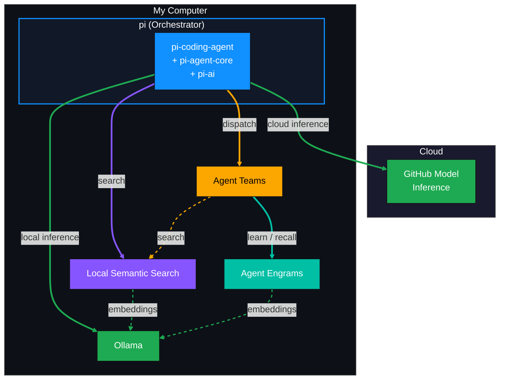
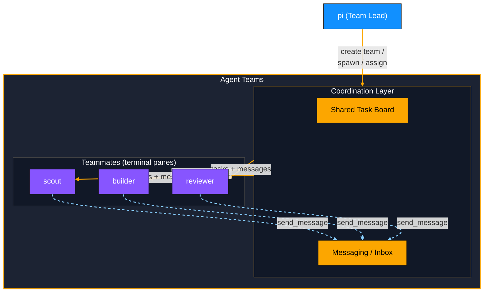
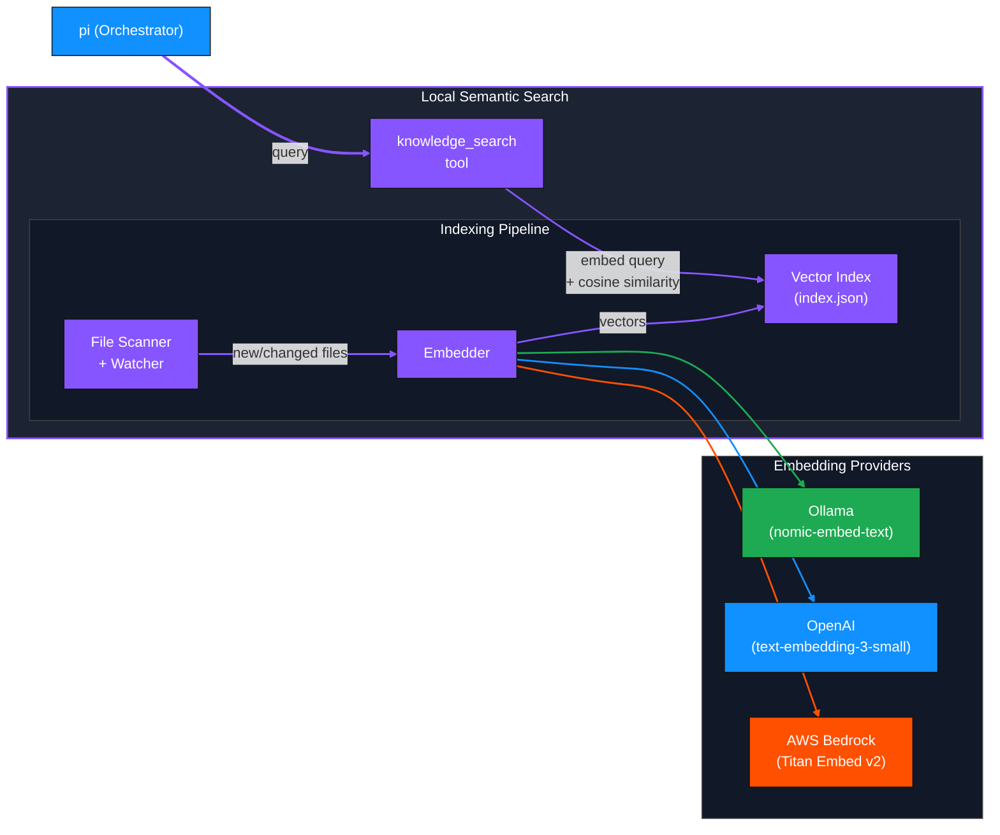
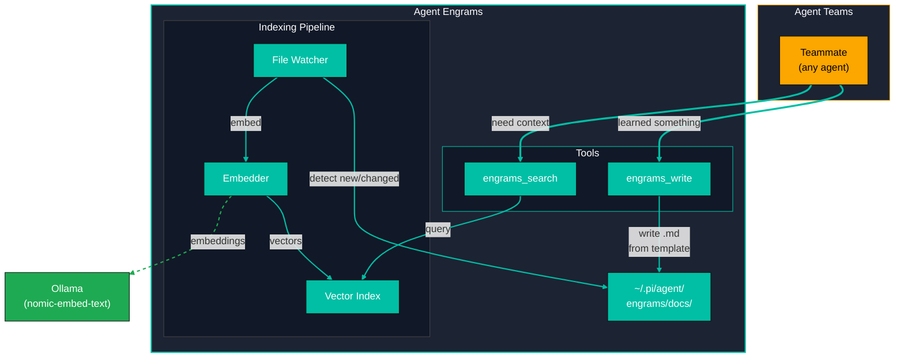

# My Agentic Harness At Home (DRAFT)

## Table of Contents

- [Architecture](#architecture)
  - [High-Level Design](#high-level-design)
  - [Inference Routing](#inference-routing)
- [Pi Coding Agent -- The Core](#pi-coding-agent----the-core)
- [Agent Teams -- Subsystem](#agent-teams----subsystem)
- [Local Semantic Search -- Subsystem](#local-semantic-search----subsystem)
- [Agent Engrams -- Subsystem](#agent-engrams----subsystem)

---

## Architecture

### High-Level Design

Pi sits at the center of the harness as the orchestrator. It routes LLM inference to either a local Ollama instance or GitHub Model Inference in the cloud, and dispatches work to subsystems for local semantic search and parallel multi-agent execution.



| Component | Location | Role |
|-----------|----------|------|
| **pi** | Local | Orchestrator. Runs the agent loop, manages sessions, routes prompts, and dispatches subsystems. The harness entry point. |
| **Ollama** | Local | Local LLM inference. Runs approved models (Qwen3, Qwen2.5-Coder) on-device via the OpenAI-compatible API at `localhost:11434/v1`. |
| **GitHub Model Inference** | Cloud | Cloud LLM inference. Frontier models (Claude, GPT, Gemini) for tasks that exceed local compute or require higher-capability reasoning. |
| **Agent Teams** | Local (Subsystem) | Parallel multi-agent coordination via terminal panes. See [Agent Teams -- Subsystem](#agent-teams----subsystem). |
| **Local Semantic Search** | Local (Subsystem) | Vector-indexed search over local files using Ollama embeddings. See [Local Semantic Search -- Subsystem](#local-semantic-search----subsystem). |
| **Agent Engrams** | Local (Subsystem) | Agent self-improvement via write-and-recall engram docs. See [Agent Engrams -- Subsystem](#agent-engrams----subsystem). |

### Inference Routing

Pi's `pi-ai` layer abstracts the inference target. The harness can route to either backend transparently:

- **Local (Ollama)** -- configured via `models.json` pointing at `http://localhost:11434/v1` with `api: "openai-completions"`. Zero cost, no network dependency, governed model list.
- **Cloud (GitHub Model Inference)** -- configured as a custom provider or via API key. Used for frontier-class reasoning, long-context tasks, or models not available locally.

The orchestrator selects the inference target per-task based on model requirements, not as a global toggle. A sub-agent doing a quick code grep can use a local Qwen model while the primary agent reasons with Claude on a complex refactor -- simultaneously.


## Pi Coding Agent -- The Core

[Pi](https://github.com/badlogic/pi-mono) (`@mariozechner/pi-coding-agent`) is an open-source, MIT-licensed terminal coding agent created by Mario Zechner. With 28k+ GitHub stars, 1.9M weekly npm downloads, and 160+ contributors, it is one of the most actively maintained agentic coding tools available. It ships four core tools -- `read`, `write`, `edit`, `bash` -- and is designed from the ground up to be embedded and extended without forking.

**Why pi is the beating heart of this harness:**

- **First-class SDK.** `createAgentSession()` gives full programmatic control: custom tools, custom system prompts, event streaming, model selection, session management, and extension loading -- all from TypeScript. No CLI wrapper hacks required.
- **Multi-provider LLM abstraction.** The sibling `@mariozechner/pi-ai` package provides a unified streaming API across Anthropic, OpenAI, Google, Azure, Bedrock, Mistral, Groq, xAI, OpenRouter, and any OpenAI-compatible endpoint (Ollama, vLLM, LM Studio). Add custom providers via `models.json` or extensions.
- **Agent runtime layer.** `@mariozechner/pi-agent-core` handles the agent loop -- tool calling, state management, event streaming, steering/follow-up queues, context compaction, and abort control -- so the harness only needs to orchestrate, not re-implement, agentic fundamentals.
- **Extension architecture.** TypeScript extensions can register custom tools, commands, keyboard shortcuts, event hooks, UI components, permission gates, sub-agent orchestration, and MCP integration. Extensions, skills, prompt templates, and themes are shareable as npm/git packages.
- **Multiple run modes.** Interactive TUI, single-shot print/JSON, JSON-RPC over stdin/stdout (for cross-language integration), and the SDK for in-process embedding. The harness can use whichever mode fits each dispatch scenario.
- **Intentionally minimal core.** Pi deliberately omits sub-agents, plan mode, permission popups, and background execution from its core, pushing those concerns into the extension/harness layer. This means the harness owns the orchestration strategy rather than fighting built-in opinions.

**Key packages in the pi-mono monorepo:**

| Package | npm | Purpose |
|---------|-----|---------|
| `pi-coding-agent` | `@mariozechner/pi-coding-agent` | CLI + SDK entry point, built-in tools, resource loading |
| `pi-ai` | `@mariozechner/pi-ai` | Unified multi-provider LLM streaming API |
| `pi-agent-core` | `@mariozechner/pi-agent-core` | Stateful agent loop, tool execution, event system |
| `pi-tui` | `@mariozechner/pi-tui` | Terminal UI library |
| `pi-web-ui` | `@mariozechner/pi-web-ui` | Web components for AI chat interfaces |

**Minimal SDK example:**

```typescript
import {
  AuthStorage,
  createAgentSession,
  ModelRegistry,
  SessionManager,
} from "@mariozechner/pi-coding-agent";

const authStorage = AuthStorage.create();
const modelRegistry = new ModelRegistry(authStorage);

const { session } = await createAgentSession({
  sessionManager: SessionManager.inMemory(),
  authStorage,
  modelRegistry,
});

session.subscribe((event) => {
  if (event.type === "message_update" && event.assistantMessageEvent.type === "text_delta") {
    process.stdout.write(event.assistantMessageEvent.delta);
  }
});

await session.prompt("What files are in the current directory?");
```

**Local reference:** The full pi-mono source is cloned at `pi.dev/pi-mono/` in this workspace. Key docs live under `packages/coding-agent/docs/` -- see `sdk.md`, `providers.md`, `models.md`, `extensions.md`, and `skills.md`.

---

## Agent Teams -- Subsystem

Agent Teams turns the single pi orchestrator into a coordinated multi-agent team. Powered by the [pi-teams](https://github.com/burggraf/pi-teams) extension (`npm:pi-teams`), it spawns specialist pi instances as "teammates" in separate terminal panes (tmux, Zellij, iTerm2, WezTerm) that work autonomously, communicate through a shared inbox/messaging system, and coordinate via a persistent task board.



### How It Works

The team lead (the original pi session) creates a team and spawns teammates. Each teammate is a full pi instance running in its own terminal pane with its own model, thinking level, tools, and system prompt. Coordination happens through file-based messaging and a shared task board -- no network calls between agents.

**Lifecycle:**

1. **Create** -- `team_create` initializes the team, registering the lead session
2. **Spawn** -- `spawn_teammate` launches pi instances in terminal panes with role-specific prompts and models
3. **Assign** -- `task_create` defines work items; teammates poll their inboxes for instructions
4. **Coordinate** -- Agents use `send_message` / `broadcast_message` / `read_inbox` to communicate; the lead reviews progress via `task_list` and `check_teammate`
5. **Gate** -- Optional plan approval mode requires teammates to submit plans before touching code
6. **Shutdown** -- `team_shutdown` kills all panes and cleans up state

### Key Capabilities

| Capability | Description |
|------------|-------------|
| **Specialist roles** | Each teammate gets a custom system prompt, tool set, model, and thinking level |
| **Shared task board** | Persistent task list with statuses: `pending`, `planning`, `in_progress`, `completed` |
| **Agent messaging** | Direct messages, broadcast, and automatic 30-second inbox polling when idle |
| **Plan approval** | Team lead can require teammates to submit implementation plans before execution |
| **Predefined teams** | Define reusable team templates in `teams.yaml` with agent definitions in `.md` files |
| **Save as template** | Convert any runtime team into a reusable template for future use |
| **Quality gate hooks** | Automated shell scripts run on task completion (tests, linting) |
| **Per-agent models** | Smart model resolution prefers OAuth/subscription providers over API-key providers to minimize cost |

### Predefined Team Templates

Teams can be defined declaratively and spawned with a single command:

```yaml
# ~/.pi/agent/teams.yaml (global) or <project>/.pi/teams.yaml (project overrides)
plan-build:
  - planner
  - builder
  - reviewer
```

```markdown
<!-- ~/.pi/agent/agents/builder.md -->
---
name: builder
description: Implementation specialist
tools: read,write,edit,bash
model: claude-sonnet-4
thinking: medium
---
You are a builder agent. Implement code following the plan provided.
```

**Local reference:** The pi-teams source is at `pi-teams/` in this workspace. See `README.md` for full usage, `docs/guide.md` for detailed examples, and `docs/reference.md` for the complete tool API.

---

## Local Semantic Search -- Subsystem

Local Semantic Search gives pi the ability to find relevant context from local files using natural language queries rather than exact text matching. Powered by the [pi-knowledge-search](https://github.com/samfoy/pi-knowledge-search) extension, it indexes directories of text and markdown files as vector embeddings, watches for changes in real-time, and exposes a `knowledge_search` tool the LLM can call.



### How It Works

1. **Index** -- On session start, the extension scans configured directories, reads text/markdown files, and generates embedding vectors. Only new or modified files are re-embedded (incremental sync).
2. **Watch** -- A file watcher monitors indexed directories for changes in real-time (debounced at 2 seconds) and updates the index automatically.
3. **Search** -- When the LLM calls `knowledge_search` with a natural language query, the query is embedded and compared against stored vectors using cosine similarity. Results are ranked by relevance and returned with file paths, scores, and content excerpts.

### Embedding Providers

The extension supports three embedding backends, chosen at configuration time:

| Provider | Model | Use Case |
|----------|-------|----------|
| **Ollama** | `nomic-embed-text` | Fully local, air-gapped, zero cost. Uses the same Ollama instance from the HLD. |
| **OpenAI** | `text-embedding-3-small` | Higher quality embeddings via API. Supports native batch embedding (up to 2048 inputs). |
| **AWS Bedrock** | `amazon.titan-embed-text-v2:0` | Cloud-hosted embeddings using the AWS credential chain (profile, IAM, IRSA). |

For the harness, the **Ollama provider** is the natural choice -- it reuses the existing local Ollama instance, keeps everything on-device, and produces no API costs. This makes the entire semantic search pipeline air-gapped.

### Configuration

Config is stored at `~/.pi/knowledge-search.json`:

```json
{
  "dirs": ["~/notes", "~/docs"],
  "fileExtensions": [".md", ".txt"],
  "excludeDirs": ["node_modules", ".git", ".obsidian", ".trash"],
  "provider": {
    "type": "ollama",
    "url": "http://localhost:11434",
    "model": "nomic-embed-text"
  }
}
```

The index persists at `~/.pi/knowledge-search/index.json`. Every config field is overridable via environment variables (see `docs/env-vars.md`).

### Performance

Typical numbers for ~500 markdown files (~20MB):

| Operation | Time |
|-----------|------|
| Full index build | ~7s |
| Incremental sync (no changes) | ~12ms |
| File re-embed (watcher) | ~200ms |
| Search query | ~250ms |
| Index file size | ~5MB |

**Local reference:** The pi-knowledge-search source is at `pi-knowledge-search/` in this workspace.

---

## Agent Engrams -- Subsystem

Agent Engrams is a self-improvement loop for agents. When an agent learns something valuable during a task -- a debugging technique, an API quirk, a domain pattern -- it writes a structured engram document to a well-known location. Later, any agent (including itself in future sessions) can semantically search that engram store to recall relevant knowledge before starting work.

The implementation is a customized fork of [pi-knowledge-search](#local-semantic-search----subsystem) scoped exclusively to `~/.pi/agent/engrams/docs/`. Agent Teams will be enhanced so that teammates automatically write to and query the engram database as part of their workflow.



### How It Works

**Write cycle (learning):**

1. An agent encounters something worth remembering -- a non-obvious fix, a domain constraint, an API behavior
2. The agent calls `engrams_write` with structured content (title, category, tags, body)
3. The tool renders a markdown file from a template and writes it to `~/.pi/agent/engrams/docs/`
4. The file watcher detects the new file, generates an embedding via Ollama, and adds it to the vector index

**Read cycle (recall):**

1. An agent starting a new task calls `engrams_search` with a natural language query describing what it needs to know
2. The query is embedded and compared against the engram index using cosine similarity
3. Ranked results (file paths, relevance scores, content excerpts) are returned to the agent's context
4. The agent incorporates relevant engrams into its reasoning

### Engram Document Template

Each engram document follows a structured markdown template to ensure consistent, searchable content:

```markdown
# <Title>

**Category:** <debugging | api | architecture | tooling | domain | performance | testing>
**Tags:** <comma-separated keywords>
**Durability:** <permanent | workaround | hypothesis>
**Agent:** <agent name that authored this>
**Date:** <ISO date>
**Source:** <ticket key, PR URL, or task description>

## Context

<What situation triggered this learning?>

## Insight

<What was learned? What's the non-obvious part?>

## Application

**Trigger:** <specific conditions when this engram is relevant>
**Anti-trigger:** <conditions when this engram should NOT be applied>

## Supersedes

<Link to older engram this replaces, or "None">
```

### Design Decisions

| Decision | Rationale |
|----------|-----------|
| **Scoped to a single directory** | `~/.pi/agent/engrams/docs/` only. Unlike general-purpose Local Semantic Search, the engram index is purpose-built and doesn't crawl arbitrary directories. |
| **Fork of pi-knowledge-search** | Reuses the proven indexing pipeline (file scanner, watcher, embedder, vector store) but with hardcoded directory, a write tool, and engram-specific prompt guidelines. |
| **Ollama embeddings only** | Since this is a local self-improvement loop, there's no reason to call cloud APIs for embeddings. Ollama with `nomic-embed-text` keeps it air-gapped and zero-cost. |
| **Shared across all agents** | All teammates in Agent Teams read and write to the same engrams directory, creating a collective memory that grows across sessions and team compositions. |
| **Structured templates** | Categories, tags, and trigger conditions in the frontmatter improve retrieval quality by giving the embedder richer semantic content to work with. |
| **Durability classification** | Each engram is tagged as `permanent` (architectural constraint, stable API behavior), `workaround` (temporary fix, likely to be superseded), or `hypothesis` (unverified, needs confirmation). Agents can weight retrieval results accordingly. |
| **Supersession chain** | Engrams can link to older engrams they replace, creating an invalidation chain. Agents retrieving a superseded engram are directed to its replacement rather than acting on stale knowledge. |

### Integration with Agent Teams

The Agent Teams subsystem will be enhanced so that teammates automatically engage with engrams:

- **On spawn** -- Each teammate queries `engrams_search` for knowledge relevant to their assigned role and initial prompt before starting work
- **On task completion** -- If a teammate learned something non-obvious during the task, it writes an engram document before reporting completion
- **On team shutdown** -- The team lead can prompt a final "lessons learned" round where teammates capture key insights

This creates a flywheel: the more tasks agents complete, the more engrams accumulate, and the better-informed future agents become from the start.

